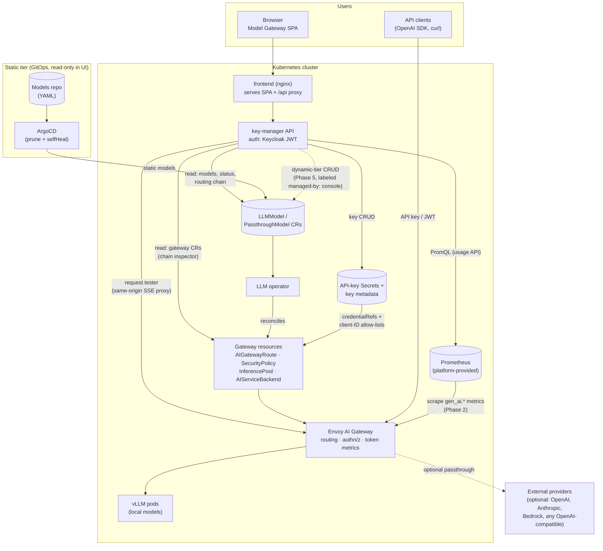

# Model Gateway UI — Phased Plan

Evolve the pack's UI from the single-page **LLM API Key Manager** into a **Model Gateway UI**: a control tower for the Envoy AI Gateway that fronts every model served by this pack. Visibility first (read-only phases), then functional management (rate limits, then model/provider configuration).

Two decisions shape the whole plan:

1. **Local-first.** Every phase must be fully useful with only self-hosted vLLM models — no external provider required, and nothing tied to OpenRouter. External providers are an optional extension; the UI's job is to make *connecting* one simple (guided flow, provider presets), never to assume one exists.
2. **Two config tiers, one write path.** Static config lives in the GitOps repo and is **read-only in the UI** — the UI never writes to Git. Dynamic config is console-managed CRUD via the key-manager API. Both tiers coexist on the same cluster; the UI only ever mutates the dynamic tier.

## Why

Today the gateway is invisible. The key-manager API deliberately drops all model status (phase, replicas, endpoints, conditions stop at its watcher), no gateway metrics are scraped anywhere, route/policy state is only reachable via kubectl, and the README's "rate limiting" is not actually configured by anything in the repo. Meanwhile Envoy AI Gateway is **headless** — no admin API, no UI. Its control surface is the CRs our operator already generates (AIGatewayRoute, SecurityPolicy, InferencePool, AIServiceBackend…), and its visibility surface is OTel GenAI metrics (`gen_ai.client.token.usage`, request duration, time-to-first-token) that nothing currently collects. A "gateway UI" is therefore a UI over this pack's CRDs plus the gateway's telemetry — both of which are already within reach of the key-manager service.

## How it all fits

Reading the diagram: the SPA only ever talks to the key-manager (same-origin through nginx). The key-manager is the single backend — it reads CRs and gateway resources for visibility, queries Prometheus for usage, proxies test requests to the gateway, and (Phase 5) writes dynamic-tier CRs. The operator remains the only thing that turns CRs into gateway configuration. Model inference traffic never touches the key-manager: API clients hit the gateway directly.

## UI direction

The organizing idea: **the gateway is the product**. The UI answers, in order: *what is routable through my gateway, is it healthy, who is using it and how much, and how do I change it?*

- **Overview** — the gateway at a glance: request/token/error rates (once telemetry lands), model count by status, failing models and provider errors surfaced as alerts, recent key activity.
- **Models** — the registry of everything routable, centered on self-hosted models: serving phase, replicas, GPU footprint, access mode (public/groups), and connection info (endpoint + model id + copyable snippets). Provider-backed models, when present, appear in the same registry with a provider badge — but the page is complete and useful with none.
- **Model detail — the routing chain inspector.** The genuinely new visibility: for one model, render the full derived chain *listener → route (match on model id) → auth policy (API key / JWT+groups) → backend (InferencePool or external provider)* with the live status/conditions of each hop, pulled from the CRs the operator generated. Today this view requires four kubectl queries and tribal knowledge; it is the fastest way to answer "why does this model 404/401?"
- **Providers** (optional section) — external upstreams promoted to first-class objects (today they are buried inside PassthroughModel spec): endpoint, wire schema, credential reference, models exposed through them, and (later) reachability/health. Hidden or shown as an empty state with a "Connect a provider" call-to-action when the install is local-only.
- **Traffic** — time-series and breakdowns over the gateway's telemetry: requests, tokens in/out, latency percentiles, TTFT, error rates; grouped by model, API key, or user; top consumers.
- **Access & Keys** — the existing self-service key CRUD, plus admin views: all keys per model, and a who-can-reach-what matrix (groups × models).
- **Request tester** — send a real request through the gateway from the browser (same-origin proxy), see streamed response, timing, token usage, and the equivalent curl. Framed as a gateway debugging tool first, chat toy second.
- **Manage** (later phases) — rate limits, provider CRUD, model CRUD; admin-gated, and only for console-managed (dynamic-tier) resources.

## The phases

| # | Phase | Type | Ships |
|---|-------|------|-------|
| 1 | Gateway map | Read-only | Overview, model registry, routing-chain inspector, providers |
| 2 | Traffic telemetry | Read-only | Usage/latency/error dashboards, per-key attribution |
| 3 | Request tester | Interactive (no config writes) | In-browser gateway requests |
| 4 | Rate limits & quotas | First writes (declarative) | Real enforcement + usage-vs-limit UI |
| 5 | Dynamic management | Full CRUD | Console-managed (dynamic) models & providers; Git tier stays read-only |
| P | Provider breadth (parallel, operator-only, optional) | — | Bedrock/Azure/Anthropic schemas + cloud credentials |

Every phase is independently shippable.

### Phase 1 — Gateway map (read-only foundation)

**Goal:** replace the single-page key manager with a multi-page console that surfaces everything the cluster already knows but hides.

- Frontend: introduce routing and the information architecture above (Overview, Models, Model detail, Providers, Keys); key management becomes one section instead of the whole app. Rename the app **Model Gateway** (branding is already runtime-configurable via `/config.json`).
- Key-manager API: stop dropping status in `key-manager/internal/models/watcher.go` — expose phase, replicas ready/desired, endpoints, conditions, kind, provider; add proper JSON tags; new read endpoints for the model registry, model detail, and provider list.
- Routing-chain inspector: key-manager reads the operator-generated CRs per model (AIGatewayRoute/HTTPRoute acceptance, SecurityPolicy auth mode, InferencePool/AIServiceBackend status) and serves a digested "chain" structure; RBAC additions (get/list/watch on those gateway CRDs) in `charts/nebari-llm-serving/templates/key-manager-clusterrole.yaml`.
- Admin plumbing used by all later phases: `keyManager.adminGroups` chart value → `isAdmin` derived from JWT groups, enforced **server-side** on every admin endpoint.
- Operator: actually write `LLMModel.status.conditions` (never set today — see `operator/internal/controller/llmmodel_controller.go`) and populate `modelSize`, so the UI has real diagnostics to show.

### Phase 2 — Traffic telemetry (the core "visibility into Envoy" phase)

**Goal:** light up the telemetry the gateway already emits but nobody collects.

- Scrape the AI Gateway ext-proc's OTel GenAI metrics via PodMonitor/ServiceMonitor + header-to-label config, so series carry the attribution headers the operator already injects at the gateway (`x-llm-client-id` for API-key traffic, `X-Auth-User` for JWT — see `operator/internal/controller/reconcilers/auth.go`) for per-key and per-user attribution. Also scrape what is exposed-but-unscraped today: EPP metrics on :9090 (queue depth, KV-cache); vLLM PodMonitors already exist.
- Key-manager: `observability.prometheusURL` chart value; a PromQL layer serving summary + time-series endpoints; honest degraded state in the UI when Prometheus is absent (its presence varies per Nebari install).
- UI: Traffic section (requests, tokens in/out, p95 latency, TTFT, error rates; by-model / by-key / by-user); per-key `lastUsedAt`; Overview gets its live numbers; model detail gets a usage sparkline; provider reachability/error-rate on the Providers page.
- Suggested additions: passthrough cost estimates (token counts × provider prices), top-consumer leaderboard, basic anomaly cues (sudden error-rate spike per model).

### Phase 3 — Request tester

**Goal:** exercise any ready model through the real gateway path from the browser — the fastest way to validate auth, routing, and streaming end-to-end.

- Browsers cannot call `llm.<baseDomain>` cross-origin (no CORS on the shared listeners), so: same-origin SSE proxy in key-manager forwarding the user's Keycloak bearer to the **internal** listener (group authz enforced twice; zero gateway changes).
- nginx (`charts/nebari-llm-serving/templates/frontend-configmap.yaml`) and the Vite dev proxy need `proxy_buffering off` + long read timeouts; validate token lifetime vs long generations.
- UI: model picker (ready models only), request parameters, streamed response with timing + token usage, copy-as-curl for both external (API key) and internal (JWT) endpoints.

### Phase 4 — Rate limits & quotas (first functional change)

**Goal:** make the README's "rate limiting" claim true, and visualize it.

- Operator: add `spec.rateLimits` (requests/min, tokens/min) to both CRDs; render `BackendTrafficPolicy` with `llmRequestCosts` keyed on `x-llm-client-id` + `x-ai-eg-model` (works on the pinned gateway v0.5; QuotaPolicy token budgets need v1.0 + Redis — defer).
- UI: limits displayed in model detail + admin views; usage-vs-limit meters from the Phase 2 telemetry layer; 429s visible in the Traffic error panels.
- Limits are plain CR fields, so they work in both tiers: set in Git for static models (UI displays them), edited in the UI for console-managed models once Phase 5 lands.

### Phase 5 — Dynamic management (CRUD on the dynamic tier)

**Goal:** configure models and external providers from the UI, coexisting with — never touching — the GitOps-managed static tier.

- **Tier mechanics:** console-created CRs are labeled `llm.nebari.dev/managed-by: console`; Git-managed CRs are classified by ArgoCD's own tracking metadata (not our label) and stay strictly read-only in the UI (managed-by badge, no edit affordances; key-manager write endpoints reject them with 409 + "managed in Git" as a backstop). ArgoCD prune only touches resources it tracks, so both tiers coexist. Everything gated behind `console.dynamicManagement.enabled` (default off).
- Key-manager: create/update/delete endpoints for `LLMModel` and `PassthroughModel`, provider-credential Secret creation, RBAC additions.
- **"Connect a provider" guided flow** — this is where "supporting other providers is simple" lands: pick a preset (OpenAI, Anthropic, AWS Bedrock, Azure OpenAI, any OpenAI-compatible URL — OpenRouter is just one preset, not a dependency), paste/reference credentials (Secret created for you), choose which model ids to expose and to whom. The flow writes an ordinary `PassthroughModel` + Secret; nothing else changes.
- **Order of writes:** the provider connect flow first (cheap to build and validate, no GPUs), then LLMModel management (guided form with GPU/storage validation from the CRD schema) — but both serve the local-first story: LLMModel CRUD is the headline for local-only installs.
- Later/optional: key lifecycle (expiry/TTL, rotation) fits naturally here.

### Workstream P — Provider breadth (parallel, operator-only, optional)

Runs alongside any phase; entirely skippable for local-only installs. It is what makes the Phase 5 connect flow cover native cloud providers instead of only OpenAI-compatible endpoints.

- Extend `PassthroughModel.spec.provider` (`operator/api/v1alpha1/passthroughmodel_types.go`; `reconcilers/passthrough.go` hardcodes `schema: OpenAI` today) with a `schema` enum (`OpenAI` default, `AWSBedrock`, `AzureOpenAI`, `Anthropic`, …) and a credential union (apiKey | aws{region, secret|IRSA} | …), mapped onto the `AIServiceBackend.schema` / `BackendSecurityPolicy` variants the gateway natively supports.
- Verify which schemas the pinned v0.5 accepts early; a bump to gateway v1.0 is likely warranted (pairs with the issue #44 modernization).
- UI impact is deliberately small: provider schema badge + matching credential form fields.

## Risks

- Prometheus presence varies per Nebari install → explicit chart value + honest empty states; Phase 2 acceptance includes the no-Prometheus path.
- Gateway v0.5 vs v1.0 skew (header-to-label metrics, provider schemas, QuotaPolicy) → spike on the pinned version at the start of Phases 2 and P.
- SSE through nginx + platform ingress must be proven end-to-end (Phase 3).
- Tier classification must rely on ArgoCD tracking metadata; a bespoke label alone would misclassify and let the UI fight ArgoCD.
- Metric cardinality (per-key × per-model) and the ~1 MiB key-Secret ceiling per model → document soft limits.

## Verification (per phase)

- Dev loop: `cd dev && make run-dev` (kind cluster; its passthrough fixtures exercise the provider path, but every phase must also be verified with local models only).
- Phase 1: registry shows real phase/replicas/endpoints with zero providers configured (Providers section shows its empty state); chain inspector reflects a deliberately broken model (bad group, missing secret); admin gating verified with `LLM_DEV_GROUPS`.
- Phase 2: kube-prometheus in the dev cluster; `gen_ai.*` series appear with client-id labels after traffic; degraded state verified with the URL unset.
- Phase 3: streamed response renders incrementally through both the Vite proxy and the nginx image.
- Phase 4: exceeding a configured limit returns 429 at the gateway; the meter reflects it.
- Phase 5: CRUD on a console model succeeds; write to an Argo-tracked model returns 409; ArgoCD does not prune console-created CRs.
- Quality gates: `frontend`: `npm run build && npm test && npm run check`; `key-manager`: `go test ./...`; `operator`: `make test`.
